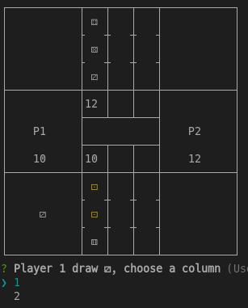
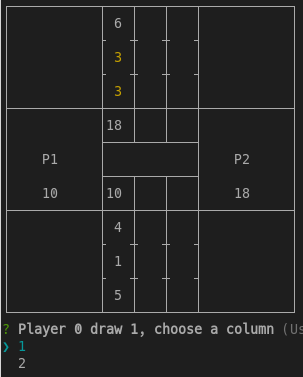
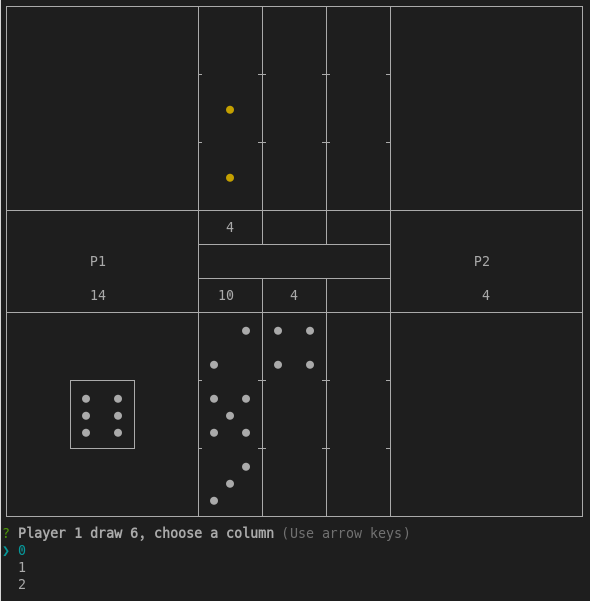

# cult-knucklebones-cli
Command Line Interface to play to game

## Options
| name | value | comment |
|------|-------|------------|
| -h, --help | none | Display help for command |
| --dice-display <type> | "utf8", "number", "zoom" | Change the display of dice |
| --p1-name | {string} | Change the name of player 1 |
| --p2-name | {string} | Change the name of player 2 |

## screnshots

